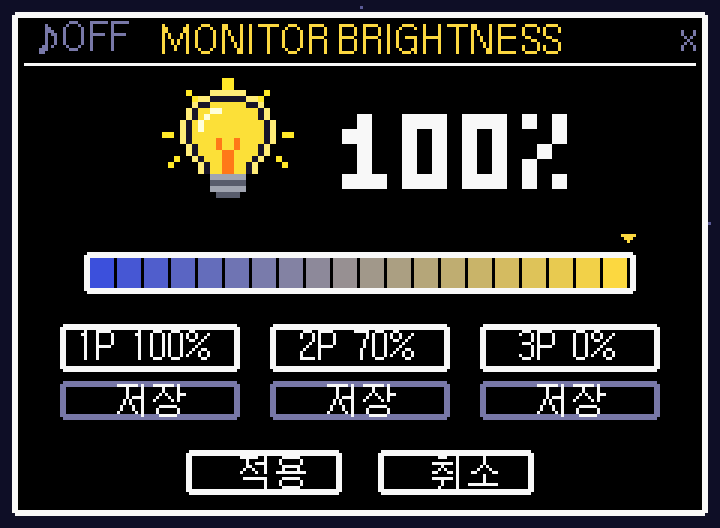

# 💡 Monitor Brightness Controller

**노트북 화면과 외부 모니터 밝기를 한 번에 조절하는 도트(픽셀) 스타일 Windows 도구**
**A pixel-art Windows tool that controls your laptop screen and external monitors at the same time**



 

[한국어](#한국어) · [English](#english)

---

> [!IMPORTANT]
> ### 🖥️ 외부 모니터 사용 전 꼭 확인하세요 / Before using with an external monitor
>
> **모니터의 화면 모드를 반드시 "사용자 지정(Custom)"으로 바꿔 주세요.**
> 게임, 시네마, 절전(Eco), Eye Saver 같은 모드에서는 모니터가 밝기를 **잠가 두기 때문에** 원하는 대로 조절되지 않을 수 있어요.
>
> 1. 모니터의 버튼(보통 앞면 아래쪽이나 뒷면의 조이스틱)을 눌러 **OSD 메뉴**를 여세요.
> 2. **화면(Picture) → 화면 모드**를 **사용자 지정(Custom)**으로 바꾸세요.
> 3. **Eye Saver / 절전(Eco Saving)** 기능이 켜져 있다면 끄세요.
> 4. 모니터 자체 **밝기를 100**으로 맞춰 두세요. 그래야 이 도구의 100%가 진짜 최대 밝기가 돼요.
>
> **Set your monitor's picture mode to "Custom" (User).**
> Preset modes such as Game, Cinema, Eco or Eye Saver **lock the brightness**, so this tool may not be able to adjust it as expected.
>
> 1. Press your monitor's button (usually a joystick under the front bezel or on the back) to open the **OSD menu**.
> 2. Go to **Picture → Picture Mode** and choose **Custom**.
> 3. Turn off **Eye Saver / Eco Saving** if they are enabled.
> 4. Set the monitor's own **brightness to 100**, so that 100% in this tool is the true maximum.

---

## 한국어

### 이런 분께 추천해요
- 노트북에 외부 모니터를 연결해서 쓰는데, 밝기를 **화면마다 따로** 맞추기 번거로운 분
- 밤에는 어둡게, 낮에는 밝게 **버튼 한 번으로** 바꾸고 싶은 분

### 기능
- **노트북 화면과 외부 모니터를 동시에 조절**: 밝기 바 하나로 모든 화면이 함께 바뀌어요.
- **실시간 미리보기**: 바를 드래그하거나 휠을 굴리는 동안 밝기가 바로 바뀌어요.
- **적용 / 취소**: 취소하면 창을 열기 전 밝기로 돌아가요.
- **설정 저장 3칸 (1P / 2P / 3P)**: 자주 쓰는 밝기를 저장하고 한 번에 불러와요.
- **우클릭 빠른 설정**: 작업표시줄이나 바탕화면 아이콘을 우클릭하면 저장한 밝기로 **창을 열지 않고** 바로 바꿀 수 있어요.
- **밝기에 따라 바뀌는 전구 아이콘**: 0%에서 100%까지 11단계로 바뀌어요.
- **8비트 효과음**: 왼쪽 위 ♪ 버튼이나 `M` 키로 켜고 꺼요.

### 설치
1. 이 페이지 위쪽의 **Code → Download ZIP**을 눌러 내려받은 뒤, 원하는 폴더에 압축을 푸세요.
2. 폴더 안의 **`install.bat`**을 더블클릭하세요.
3. 바탕화면에 생긴 **"밝기 전환"** 아이콘을 더블클릭하면 창이 열려요.
4. (선택) 아이콘을 우클릭한 뒤 **작업 표시줄에 고정**하고 창을 한 번 열었다 닫으면, 작업표시줄 우클릭 빠른 설정이 생겨요.

> 설치한 뒤에는 폴더를 옮기지 마세요. 옮겼다면 `install.bat`을 다시 실행하세요.
> Windows 11에서는 바탕화면 아이콘을 **Shift + 우클릭**해야 빠른 설정이 보여요.

### 단축키
| 키 | 동작 |
|---|---|
| ← / → | 1%씩 조절 |
| ↑ / ↓ | 10%씩 조절 |
| 마우스 휠 | 5%씩 조절 |
| 1 / 2 / 3 | 저장한 설정 불러오기 |
| M | 소리 켜기/끄기 |
| Enter / Esc | 적용 / 취소 |

### 외부 모니터 동작 방식
외부 모니터는 **Windows가 화면으로 내보내는 색을 어둡게 하는 방식**(감마 조절)으로 밝기를 바꿔요. 모니터 제조사마다 제각각인 밝기 명령(DDC/CI) 지원에 기대지 않기 때문에 **대부분의 모니터에서 작동해요.**

- Windows 기본 설정에서는 외부 모니터가 **약 50%까지만** 어두워져요. 더 어둡게 하려면 **관리자 권한 PowerShell**에서 아래 명령을 실행한 뒤 재부팅하세요.
  ```
  reg add "HKLM\SOFTWARE\Microsoft\Windows NT\CurrentVersion\ICM" /v GdiIcmGammaRange /t REG_DWORD /d 256 /f
  ```
- 절전 모드에서 깨어나면 외부 모니터 밝기가 원래대로 돌아갈 수 있어요. 그럴 땐 저장한 설정을 한 번 눌러 주세요.

### 제거
**`uninstall.bat`**을 실행하면 밝기를 100%로 되돌리고, 바로가기와 우클릭 메뉴를 지워요. 그다음 폴더를 삭제하세요.

---

## English

### Who is this for?
- You use a laptop with an external monitor and are tired of adjusting **each screen separately**.
- You want to switch between dark (night) and bright (day) with **a single click**.

### Features
- **Laptop + external monitors at once**: one slider changes every screen together.
- **Live preview**: brightness changes in real time while you drag, scroll or press arrow keys.
- **Apply / Cancel**: cancel restores the brightness you had before opening the window.
- **3 save slots (1P / 2P / 3P)**: save your favorite levels and load them instantly.
- **Right-click quick presets**: right-click the taskbar or desktop icon to jump to a saved level **without opening the window**.
- **Dynamic bulb icon**: changes across 11 levels from 0% to 100%.
- **8-bit sound effects**: toggle with the ♪ button (top left) or the `M` key.

### Install
1. Click **Code → Download ZIP** at the top of this page and extract it to any folder.
2. Double-click **`install.bat`** in that folder.
3. Double-click the new **"밝기 전환"** (Brightness) icon on your desktop.
4. (Optional) Right-click the icon → **Pin to taskbar**, then open and close the window once to enable the taskbar quick presets.

> Don't move the folder after installing. If you do, run `install.bat` again.
> On Windows 11, **Shift + right-click** the desktop icon to see the quick presets.

### Shortcuts
| Key | Action |
|---|---|
| ← / → | ±1% |
| ↑ / ↓ | ±10% |
| Mouse wheel | ±5% |
| 1 / 2 / 3 | Load saved slot |
| M | Sound on/off |
| Enter / Esc | Apply / Cancel |

### How external monitors are controlled
External monitors are dimmed by **darkening the colors Windows sends to the screen** (gamma ramp). This does not depend on each manufacturer's DDC/CI support, so it **works with most monitors**.

- By default Windows only allows dimming external monitors to **about 50%**. To go darker, run this in an **administrator PowerShell** and reboot:
  ```
  reg add "HKLM\SOFTWARE\Microsoft\Windows NT\CurrentVersion\ICM" /v GdiIcmGammaRange /t REG_DWORD /d 256 /f
  ```
- After waking from sleep, an external monitor may return to full brightness. Just click a saved preset again.

### Uninstall
Run **`uninstall.bat`**. It restores 100% brightness and removes the shortcut and right-click menu entries. Then delete the folder.

---

### Requirements / 요구 사항
- Windows 10 / 11
- No extra software needed. It uses the built-in Windows PowerShell 5.1. / 별도 설치 없이 Windows 기본 PowerShell 5.1로 작동해요.

### License
MIT
